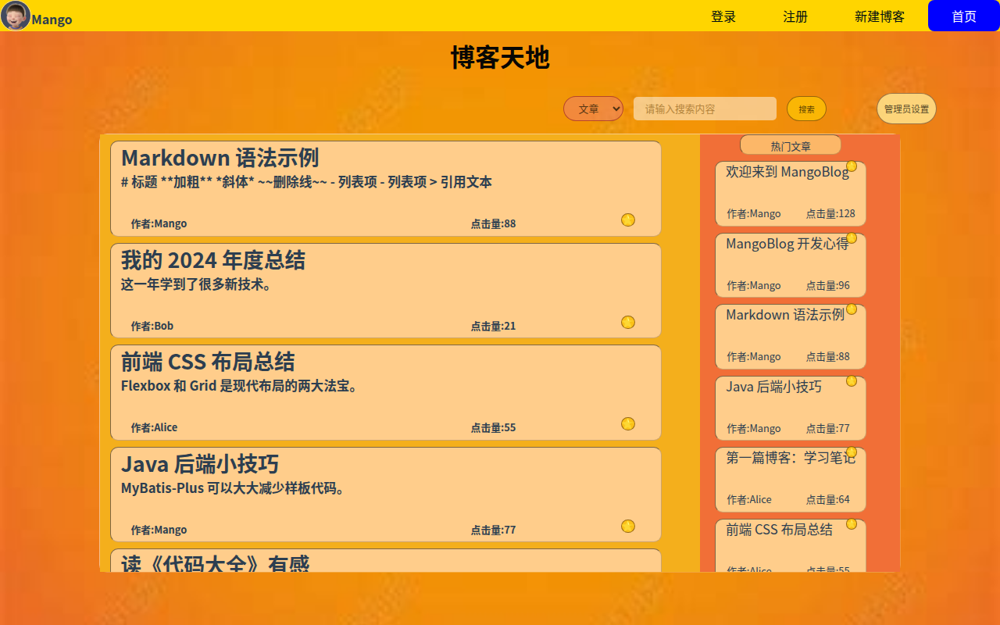
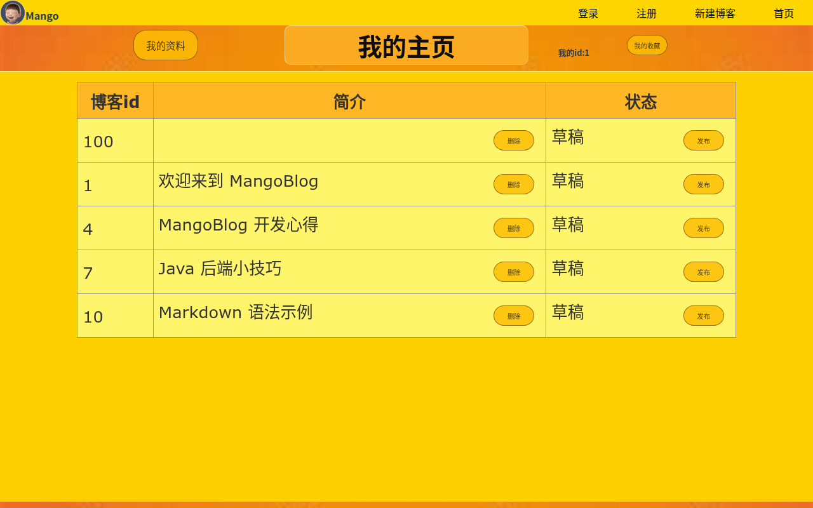
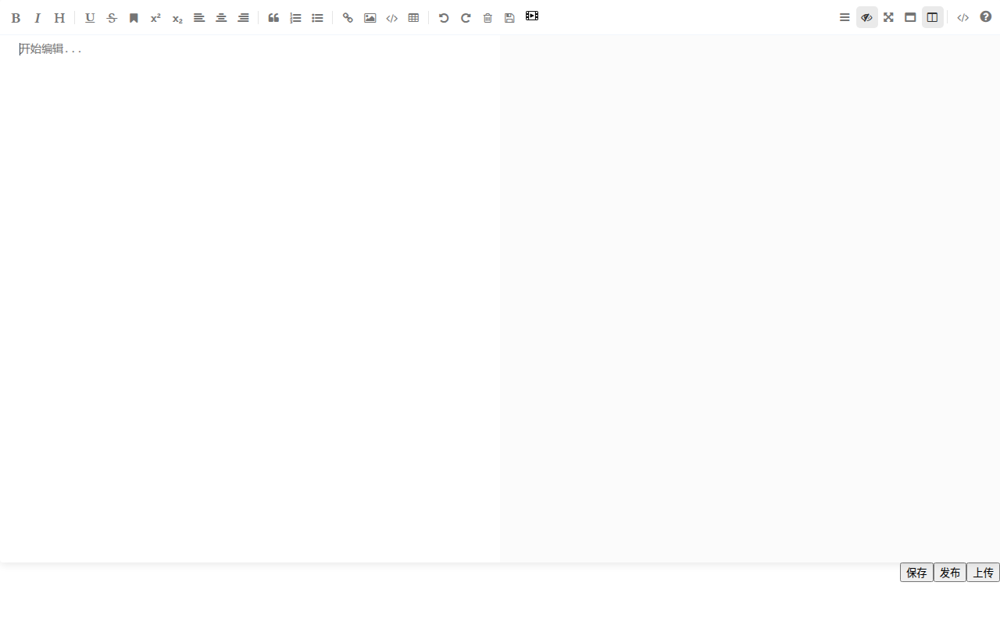
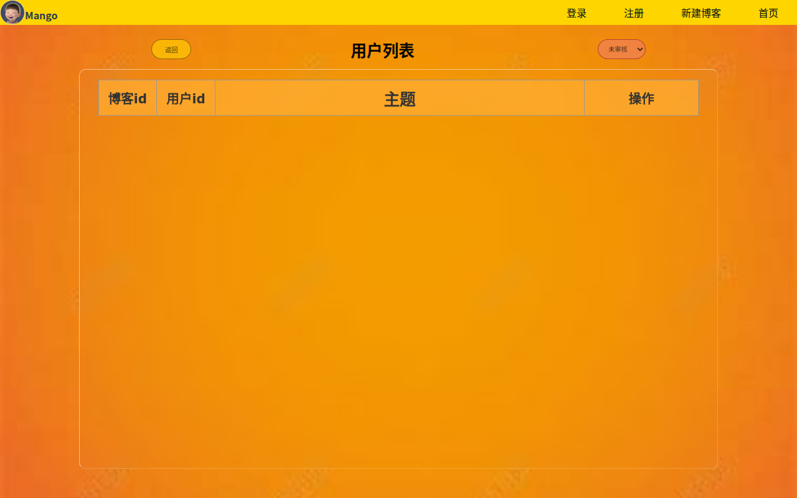

# MangoBlog 芒果博客前端
[前端仓库](https://github.com/9-Extra/MangoBlogFront)
[后端仓库](https://github.com/9-Extra/MangoBlogBack)

**以下描述是项目开始时的设想，存在部分未实现和实现了没写的**
___
## 我们要做个什么
**一个像QQ空间或者B站动态那样允许很多人分享或写文章的网站**  

1. 第一阶段
+ 支持注册,注销和登录
+ 显示动态列表
+ 用户写动态
+ 允许管理员登录并删除任何用户的动态，删除用户
2. 第二阶段
+ 设置和更换头像，昵称，可以让用户再网页上完成头像裁剪
+ 设置和更换手机号，邮箱等信息
+ 使用markdown写动态
+ 折叠较长动态
+ 支持插入图片，视频，音乐，文件，并支持下载
3. 第三阶段
+ 允许管理员对动态，图片，视频，音乐，文件进行检查，屏蔽和删除
+ 支持对资源进行搜索
+ 支持对动态的点赞和评论，以及对评论的评论
___
## 我们要怎么做
+ **前后端分离**  
前端使用VUE制作漂亮的界面，使用axios向后端发送请求。后端使用spring mvc响应前端请求，使用mybatis-plus + mysql记录操作用户表，动态表，动态的文本性内容。视频，图片等体积较大的资源直接使用文件记录，数据库中仅记录路径和权限信息。
+ **视频播放**  
使用video js播放视频
+ **网页制作**  
手写css + vue，各种素材网上找吧
+ **用户登录**  
使用token，参考[SpringBoot实现基于token的登录验证](https://blog.csdn.net/qq_36816062/article/details/108631606)。前端检查用户的登录状态，请求用户的信息，将用户的头像和昵称（或者“未登录”）显示在右上角。
+ **markdown支持**  
使用[showdown.js](https://github.com/showdownjs/showdown)，还需要前端的一些工作，最好有一个可以实时显示结果的编辑界面供用户使用。
+ **资源进行搜索**  
具体的搜索交给数据库（资源数量不会太多），需要将用户的搜索请求转化为对数据库的搜索，并检查搜索请求是否合理，限制搜索的频率。

___
## 界面预览

> 以下为 MangoBlog 前端主要页面截图，使用本地 Mock 数据运行后截取。

### 登录 / 注册

| 登录页 | 注册页 |
| --- | --- |
|  |  |

### 博客天地

展示博客列表、热门文章、搜索入口以及管理员快捷入口。

### 我的博客 / 个人主页

登录后可查看自己发布的博客草稿与已发布文章，支持删除、发布、修改等操作。

### Markdown 博客编辑器

基于 mavon-editor 的所见即所得 Markdown 编辑器，支持图片、视频等资源插入。

### 博客详情页

展示单篇博客的 Markdown 渲染内容、作者信息以及评论区域。

### 搜索结果

支持按文章或用户搜索，管理员可在此进行内容审核。

